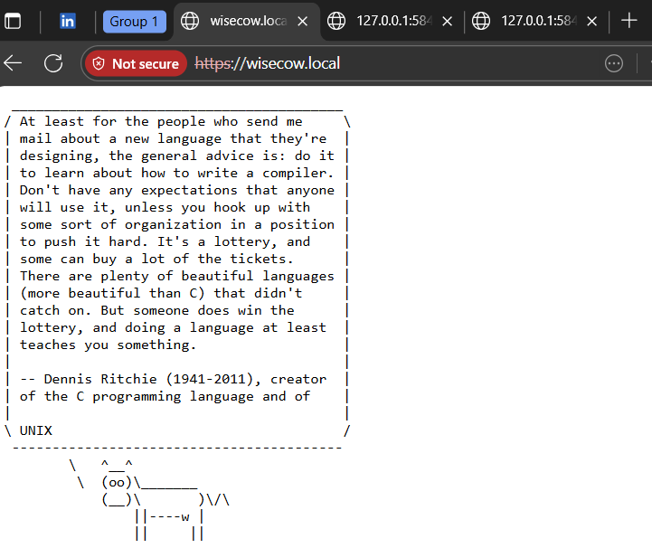

# DevOps Project Deployment Guide

This guide provides step-by-step instructions for building Docker images, testing them locally, pushing them to Docker Hub, deploying Kubernetes manifests, setting up ingress with certificates, running GitHub Actions pipelines, and automating tasks using Bash scripts.

---

## 1. Build Docker Image

```bash
# Navigate to project directory
cd project-directory

# Build Docker image
docker build -t <your-dockerhub-username>/<image-name>:<tag> .
```

---

## 2. Test Docker Image Locally

```bash
# Run the container locally
docker run -d -p 4499:4499 <your-dockerhub-username>/<image-name>:<tag>

# Verify container is running
docker ps

# Test application
curl http://localhost:4499
```

---

## 3. Push Docker Image to Docker Hub

```bash
# Log in to Docker Hub
docker login

# Push the image
docker push <your-dockerhub-username>/<image-name>:<tag>
```

---

## 4. Deploy Kubernetes Manifests

```bash
# Apply Kubernetes manifests from the repo
kubectl apply -f k8s/
```

---

## 5. Setup Ingress and Certificates

required for creating self signed certificates
```bash
openssl req -x509 -nodes -days 365 -newkey rsa:2048 \
  -keyout wisecow.key \
  -out wisecow.crt \
  -subj "/CN=wisecow.local/O=wisecow"

```

```bash
# Create TLS secret for ingress
kubectl create secret tls my-tls-secret   --cert=path/to/cert.crt   --key=path/to/cert.key

# Apply ingress manifest (already present in repo)
kubectl apply -f k8s/ingress.yaml

# Verify ingress
kubectl get ingress
```

---

## 6. GitHub Actions Workflow

The GitHub Actions workflow is configured in `.github/workflows/ci-cd.yml`. It performs:

1. **Build Docker Image**
2. **Push Image to Docker Hub**
3. **Deploy Kubernetes Manifests**
4. **Verify Deployment**

---

## 7. Bash Scripts

Bash scripts automate repetitive tasks:

### 7.1 Build & Push Image

```bash
#!/bin/bash
IMAGE_NAME="<your-dockerhub-username>/<image-name>:<tag>"
docker build -t $IMAGE_NAME .
docker push $IMAGE_NAME
```

### 7.2 Deploy to Kubernetes

```bash
#!/bin/bash
kubectl apply -f k8s/
```

### 7.3 Setup Ingress

```bash
#!/bin/bash
kubectl create secret tls my-tls-secret   --cert=path/to/cert.crt   --key=path/to/cert.key

kubectl apply -f k8s/ingress.yaml
```

---
### 7.4 Add DNS resolution in /etc/hosts

path: C:\Windows\System32\drivers\etc\hosts
```
127.0.0.1 wisecow.local #add any domain you wish to
```
### Enable Minikube Tunnel for Ingress:
```
minikube tunnel

```

## 8. Verification

```bash
# Verify pods
kubectl get pods

# Verify services
kubectl get svc

# Verify ingress
kubectl get ingress
```
## Connection Establishment
if everything run fines
```url
https://wisecow.local
```

# Bash Scripting for automation tasks:

```bash
# make executable
chmod +x scripts/system_health.sh scripts/app_health.sh

# run manually
sudo bash scripts/system_health.sh
bash scripts/app_health.sh http://wisecow.local
```
### Schedule with Cronjobs:
```bash
crontab -e
# add lines (example)
*/5 * * * * /bin/bash /full/path/to/scripts/system_health.sh
*/2 * * * * /bin/bash /full/path/to/scripts/app_health.sh https://wisecow.local
```

# Final notes & best practices

Never commit private keys / certs (*.key) to a public repo. Commit instructions for generating them instead.

For CI/CD automatic deployment, GitHub runners must have network access to your cluster; for local clusters prefer a self-hosted runner or skip automatic deploy.

For optional PS3 (KubeArmor), use WSL2/Linux VM or Kind in Linux — Docker Desktop on Windows often lacks /sys/kernel/security required by KubeArmor.

Replace yourhubuser with your actual Docker Hub username (or GHCR path if you use GitHub Container Registry).

## Proof of TLS Deployment

The Wisecow application is successfully deployed with TLS on Kubernetes.  


